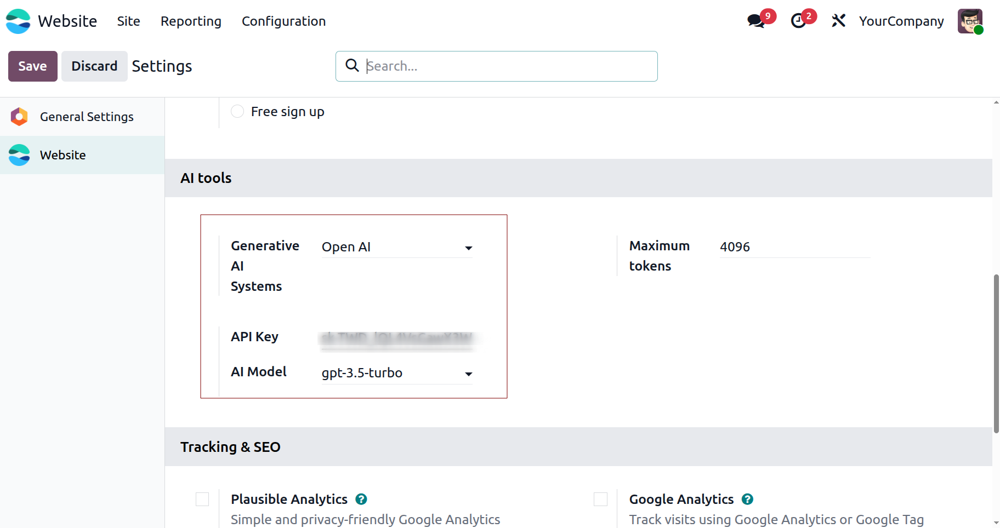
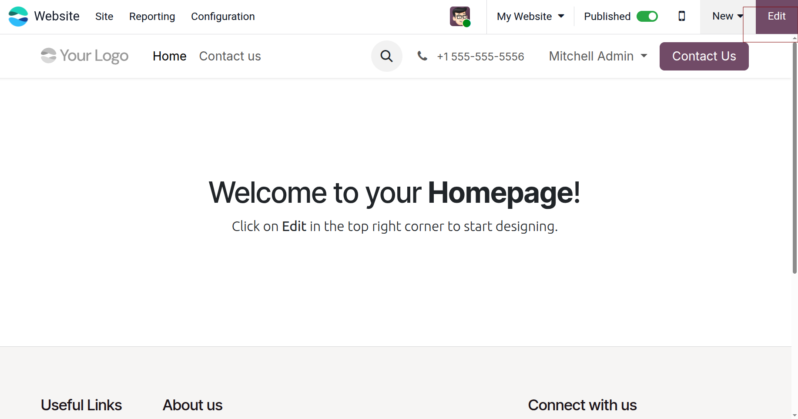
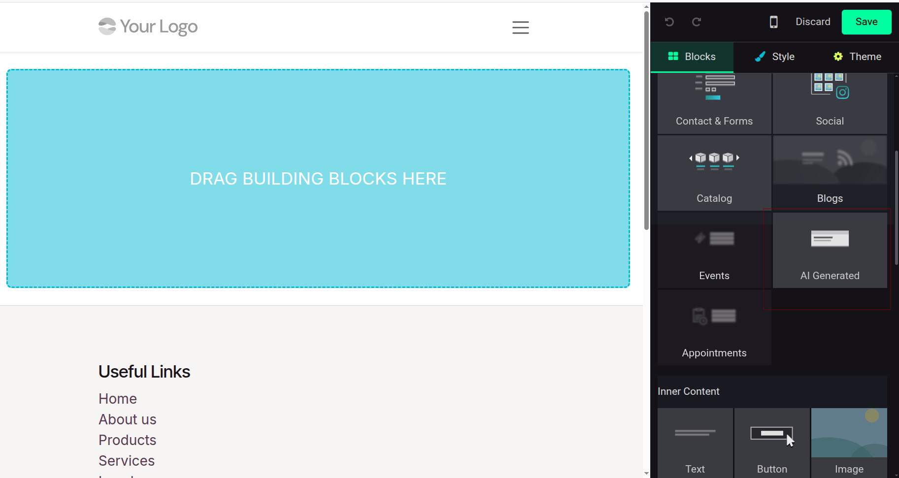
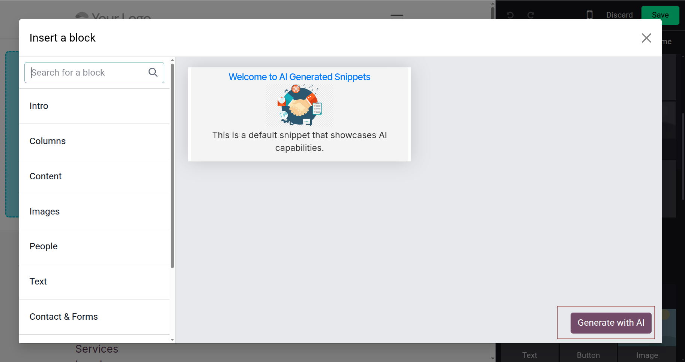
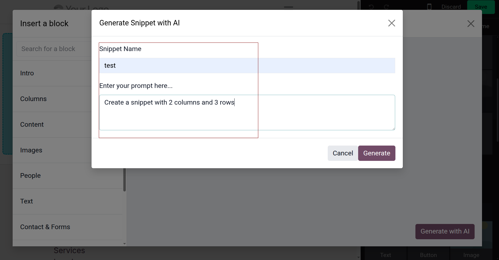
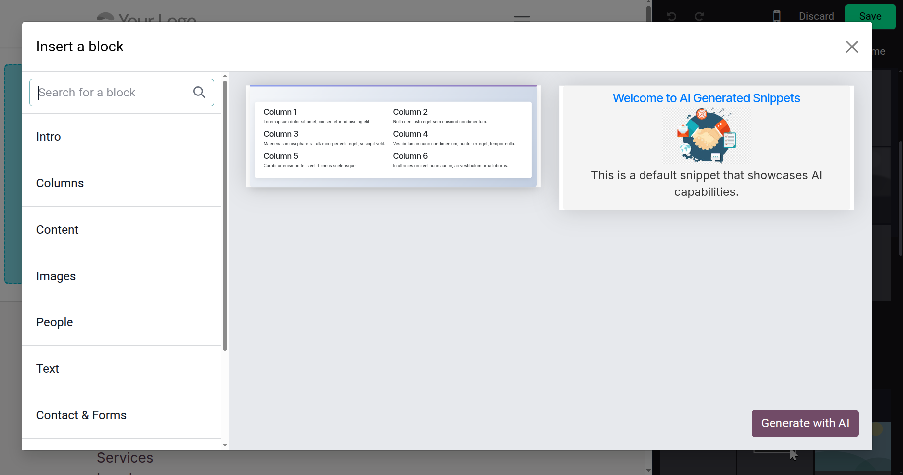

# Generative AI for Odoo 19

[](https://www.odoo.com)
[](https://opensource.org/licenses/MIT)

## Overview

The Generative AI for Odoo 19 module allows users to generate website snippets using AI-powered text prompts directly within the Odoo Website Editor. It seamlessly integrates with OpenAI and OpenRouter to enhance content creation and streamline web development workflows.

## Features

- 💾 Instantly generate custom website snippets from text prompts using OpenAI or OpenRouter.
- 🧠 Create, preview, and insert AI-generated snippets directly within Odoo’s website editor.
- ⚙️ Easily configure AI provider, model, and token limits from Odoo settings for full control.

## Screenshots

Here are some glimpses of Generative AI

### User Interface of Website module

<div>
  <tr>
    <td align="center">
      
    </td>
  </tr>
</div>
<div>
  <tr>
    <td align="center">
      
    </td>
  </tr>
</div>
<div>
  <tr>
    <td align="center">
      
    </td>
  </tr>
</div>
<div>
  <tr>
    <td align="center">
      
    </td>
  </tr>
</div>
<div>
  <tr>
    <td align="center">
      
    </td>
  </tr>
</div>
<div>
  <tr>
    <td align="center">
      
    </td>
  </tr>
</div>


## Prerequisites

Before you begin, ensure you have the following installed:

- An active Odoo Community/Enterprise Edition instance (local or hosted)

## Configuration
- Ensure the OpenAI Python package is installed.

## Installation

Follow these steps to set up and run the app:

1. **Clone the Repository**

   ```git clone https://github.com/cybrosystech/Generative-AI.git```
   
2. **Add the module to addons**

   ```cd Generative AI```

## Contributing

We welcome contributions! To get started:

1. Fork the repository.

2. Create a new branch:  
   ```  
   git checkout -b feature/your-feature-name  
   ```  
3. Make changes and commit:  
   ```  
   git commit -m "Add your message here"  
   ```  
4. Push your changes:  
   ```  
   git push origin feature/your-feature-name  
   ```  
5. Create a Pull Request on GitHub.  

---
- Submit a pull request with a clear description of your changes.

## License

This project is licensed under the AGPL-3. Feel free to use, modify, and distribute it as needed.


Company
-------

* `Cybrosys Techno Solutions <https://cybrosys.com/>`

## Contact

* Mail Contact : odoo@cybrosys.com
* Website : https://cybrosys.com


Maintainer
==========

https://cybrosys.com


This module is maintained by Cybrosys Technologies.
For support and more information, please visit https://www.cybrosys.com