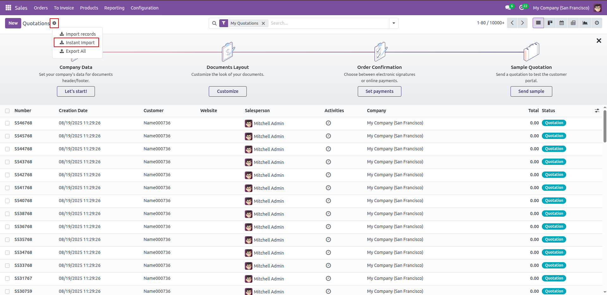
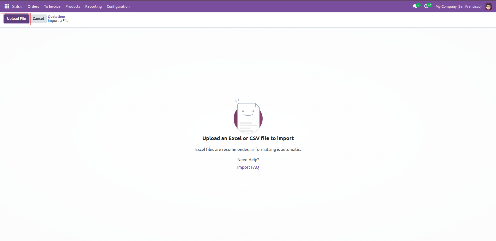
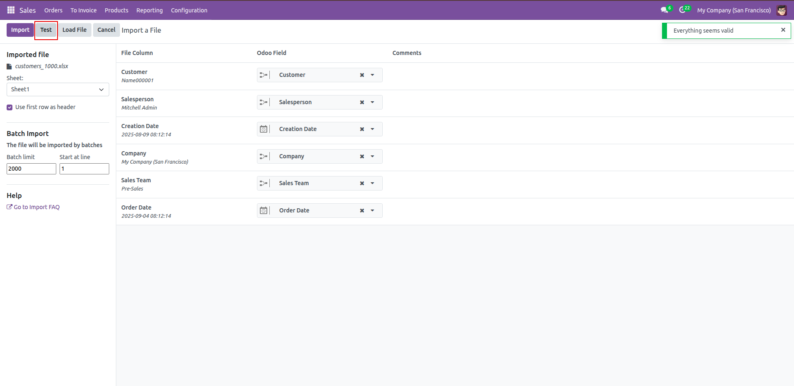
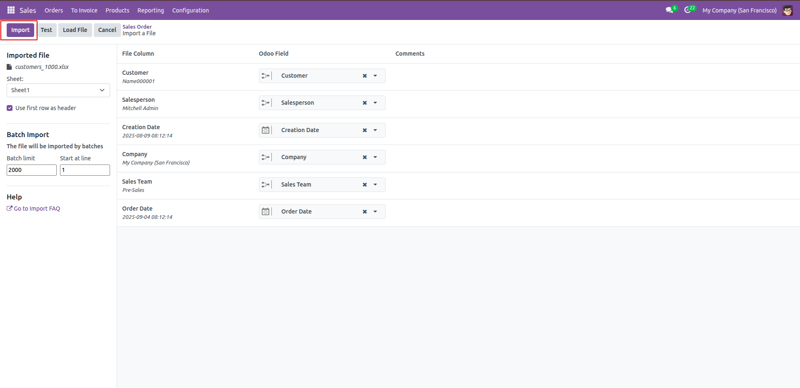
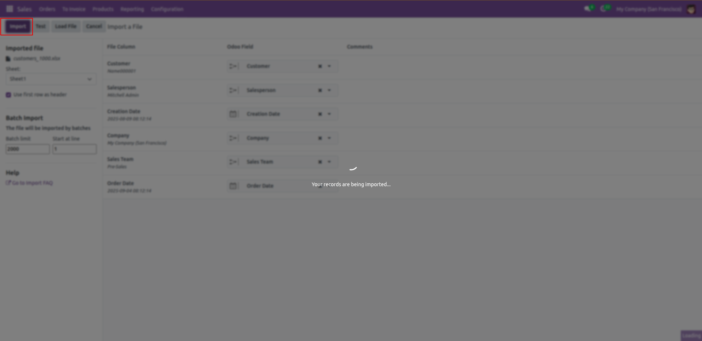
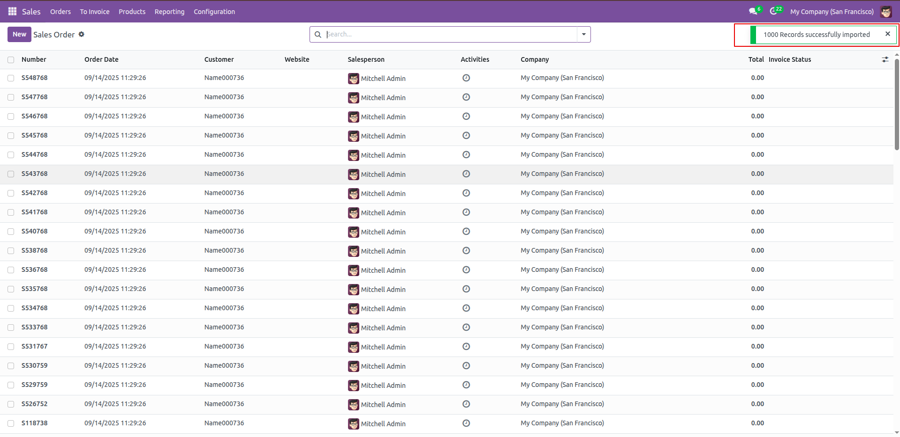

# Instant Import for Odoo 17

## Overview

The Instant Import module is an Odoo extension that streamlines the data import
process by providing a user-friendly interface built with OWL. It lets users 
test and import Excel data into any model with validation, error feedback, and
smooth record creation. Designed for performance, the module ensures that large
volumes of data are imported quickly and efficiently.

## Features

- Features
- **Fast Data Import**: Quickly import large volumes of records from Excel files into any Odoo model.
- **Real-Time Validation**: Instantly checks for field mismatches or errors before importing.
- **OWL-Based Interface**: Modern and responsive UI built with Odoo Web Library (OWL) for smooth user experience.
- **Seamless Record Creation**: Automatically creates records without navigating away from the current view.
## Screenshots

Here are some glimpses of Odoo Instant Import:

### Sales module

  <tr>
    <td align="center">
      
    </td>
  </tr>

  <tr>
    <td align="center">
      
    </td>
  </tr>

  <tr>
    <td align="center">
      
    </td>
  </tr>

  <tr>
    <td align="center">
      
    </td>
  </tr>

  <tr>
    <td align="center">
      
    </td>
  </tr>

  <tr>
    <td align="center">
      
    </td>
  </tr>

## Prerequisites

Before you begin, ensure you have the following installed:

- An active Odoo Community/Enterprise Edition instance (local or hosted)
