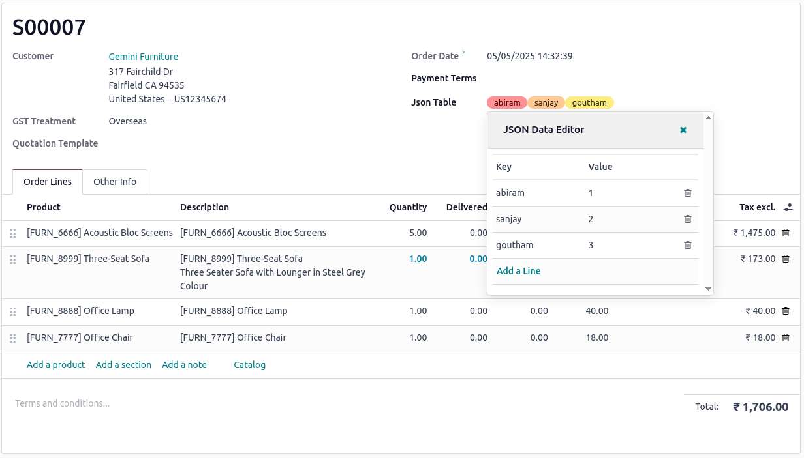

# JSON Widget for Odoo 17

An interactive and intuitive widget for managing JSON fields in Odoo 17, built using the modern OWL JavaScript framework.

## Overview

The JSON Widget is an Odoo module designed to simplify the management of JSON fields by providing an intuitive, interactive interface using OWL, allowing users to view, edit, and organize key-value data seamlessly within the Odoo backend.

## Features

- Features
- 🧩 **Interactive JSON Editor**: Easily add, edit, and delete key-value pairs with a user-friendly UI.
- ⚙️ **Seamless Odoo Integration**: Works effortlessly with Odoo 17 models using JSON fields.
- 🚀 **Modern OWL Framework**: Built with Odoo's OWL JavaScript framework for reactive and responsive behavior.
- 💾 **Structured Data Management**: Ensures clean and consistent JSON data storage within your records.
## Screenshots

Here are some glimpses of Json Widget:

### User Interface of WebView

  <tr>
    <td align="center">
      
    </td>
  </tr>

